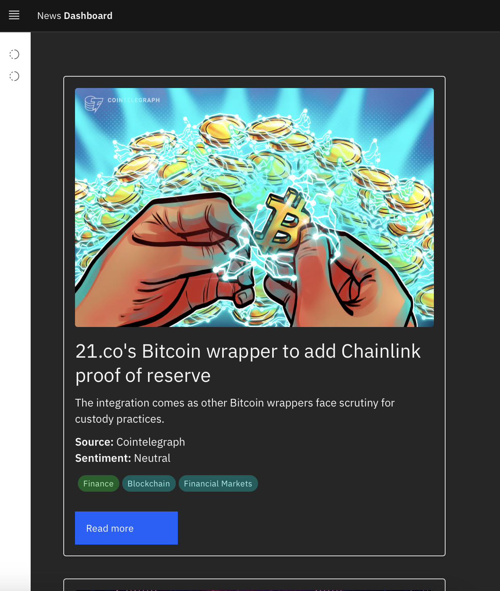

# News Dashboard

Welcome to the **News Dashboard** project! This application provides a sleek and modern interface for displaying the latest news articles with sentiment analysis using Svelte and Carbon Components.



## Project Overview

The News Dashboard fetches news articles from a [Alpha Vantage](https://www.alphavantage.co) API and presents them in a user-friendly format. Each news article is displayed as a card that includes key information such as:

- **Banner Image**: A visual representation of the article.
- **Title**: The headline of the news article.
- **Summary**: A brief overview of the content.
- **Source**: The publication or website where the article originates.
- **Overall Sentiment Label**: An analysis of the article's sentiment (positive, negative, neutral).
- **Topics**: Relevant topics associated with the article along with their relevance scores.

The application is built using [Svelte](https://svelte.dev/) for the frontend and utilizes [Carbon Components](https://www.carbondesignsystem.com/) for a polished design. It is responsive and works seamlessly across various devices.

## Features

- **Dynamic News Fetching**: The application retrieves news articles in real-time from the API endpoint.
- **Responsive Design**: A mobile-friendly interface that adapts to different screen sizes.
- **Interactive UI**: Users can navigate through the news board easily with a responsive menu.
- **Sentiment Analysis**: Visual representation of sentiment for each news article with color-coded tags based on relevance.

## Technologies Used

- **Svelte**: A modern JavaScript framework for building user interfaces.
- **Carbon Components**: A library of UI components that follows the IBM design system.
- **API Integration**: Fetching crypto news data using RESTful API.

## Getting Started

To get a local copy of this project up and running, follow these steps:

1. Clone the repository:
   ```bash
   git clone https://github.com/parhammrd/news-dashboard.git

2. Navigate to the project directory:
   ```bash
   cd news-dashboard
   ```
3. Install the dependencies:
   ```bash
   npm install
   ```
4. Run the application:
   ```bash
   npm run dev
   ```
5. Open your browser and navigate to `http://localhost:3000`.
